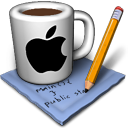
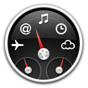
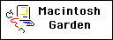

	
	
	
	
 
	
	
	
	

<h1 align="center">AppleElements</h1>
<h2 align="center">A collection of Apple GUI elements from Mac OS and more</h2>

### Resources
- **AppleElements** – Main catalogue of Mac OS elements and resources (coming soon)

### Websites
- **Macintosh Garden** – Abandonware archive featuring CD / DVD images of Mac OS software

	
- **Internet Archive** – Digital library including application software for Mac OS

	
